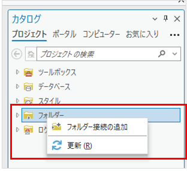
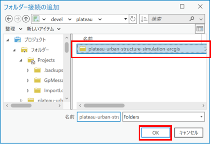
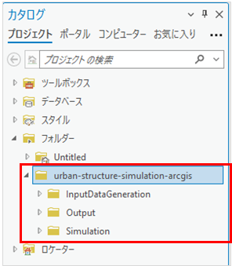

# 1. インストール

## 1.1. プログラムの配置

「plateau-urban-structure-simulation-arcgis.zip」を任意のフォルダーに配置し解凍する。

## 1.2. ArcGIS Proの設定

ArcGIS Proを起動する。

画面右側の「カタログ」ウィンドウより「フォルダー」を右クリックし、「フォルダー接続の追加」を選択する。

1の工程で解凍した `plateau-urban-structure-simulation-arcgis` のフォルダーを選択した状態で「OK」をクリックする。

「カタログ」ウィンドウより「フォルダー」をダブルクリックした際に、上述の工程で選択した`plateau-urban-structure-simulation-arcgis` フォルダーが表示されていたら接続されている。

以降の説明で示すファイルパスは `plateau-urban-structure-simulation-arcgis` フォルダーからの相対パスを記述する。

## 1.3. ローカルシーンの起動

ArcGIS Proの「挿入」タブより「新しいマップ」をクリックし、「新しいローカルシーン」を選択する。

ローカルシーンを起動すると、ArcGIS Proの画面中央部にマップが表示される。

