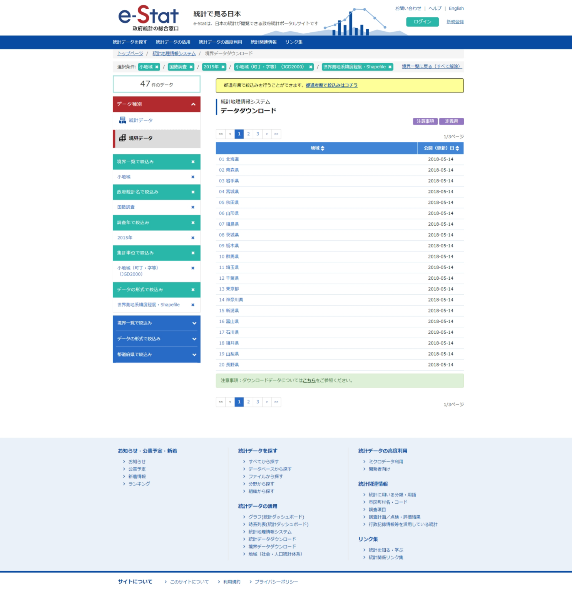
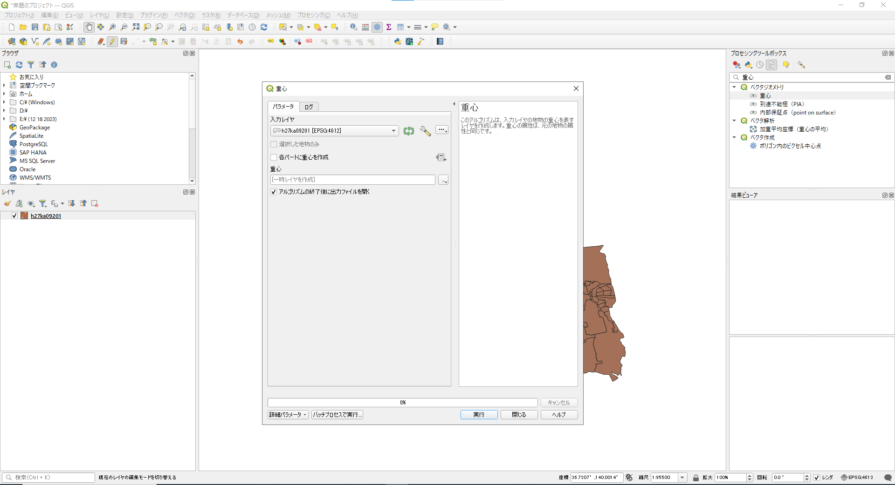
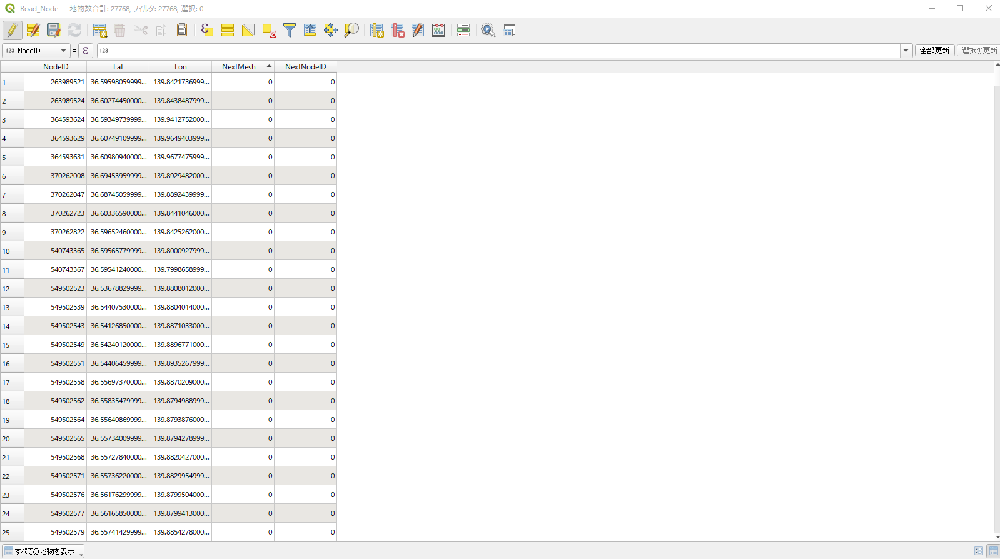
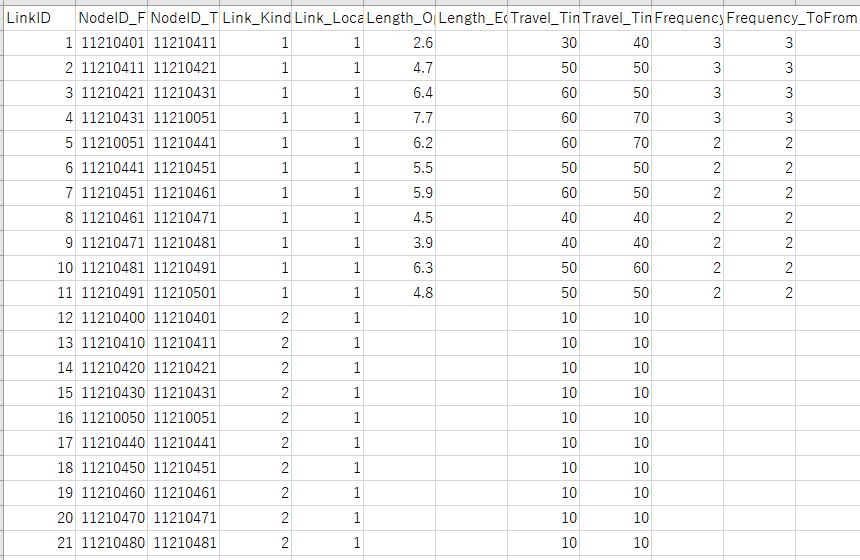
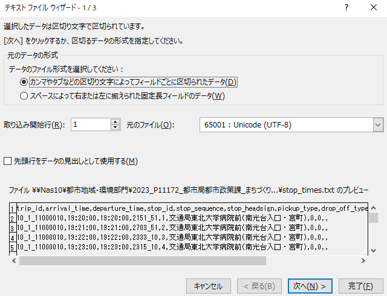
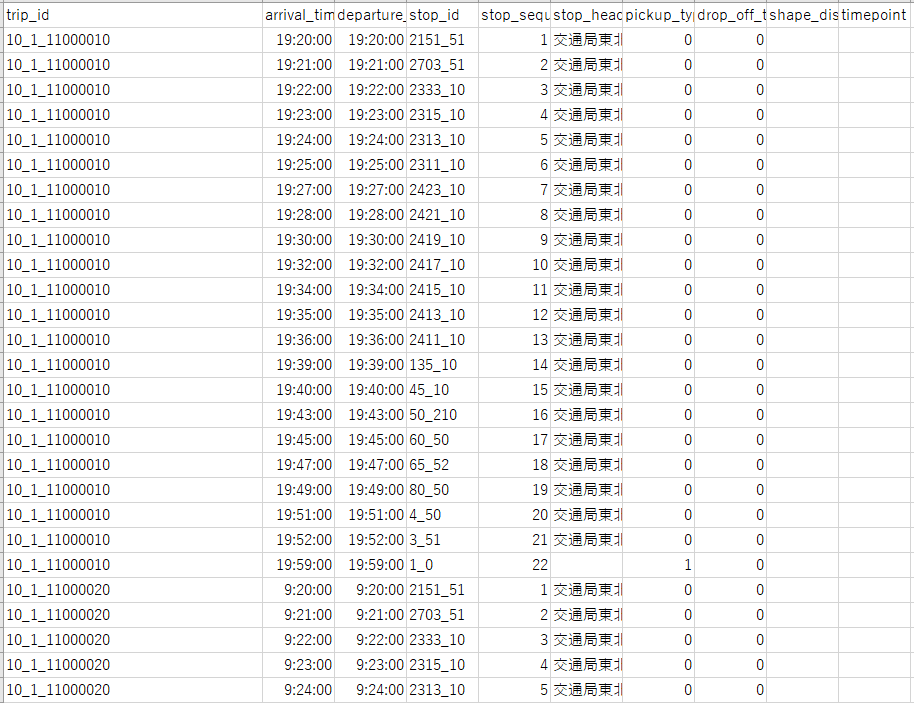
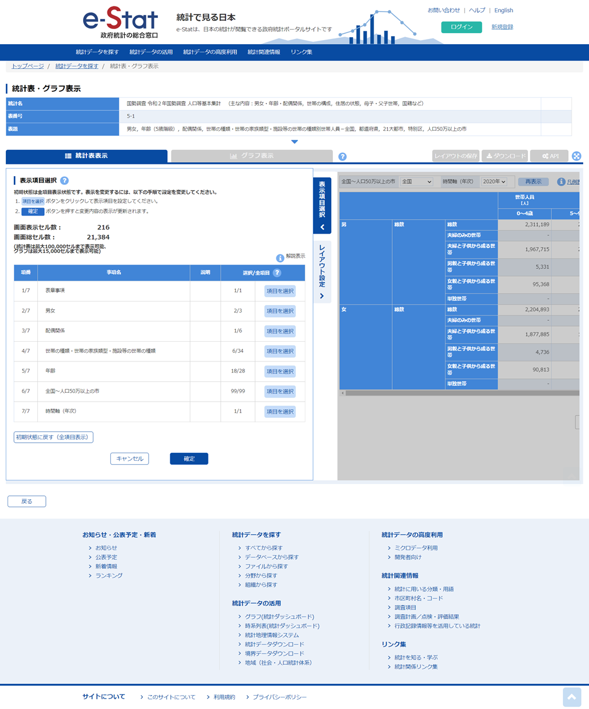

# 2. データの準備

システムを操作するために準備する必要があるデータは以下のとおりである。

|           データ名           |                  ファイル名                  |    形式     |                                        利用機能                                        |
| ---------------------------- | -------------------------------------------- | ----------- | -------------------------------------------------------------------------------------- |
| 建築物データ                 | lod1_Building（任意に変更可）                | GeoDataBase | 建築物データ作成機能                                                                   |
| 土地利用データ               | lod1_UseDistrict（任意に変更可）             | GeoDataBase | 建築物データ作成機能                                                                   |
| 都市計画決定情報データ       | lod1_LandUse（任意に変更可）                 | GeoDataBase | 建築物データ作成機能                                                                   |
| ゾーンポリゴンデータ         | Zone_Polygon                                 | SHP         | 建築物データ作成機能、インプットデータ生成機能（ゾーンデータ、交通データ、個人データ） |
| 施設ポイントデータ           | Facility_Point                               | CSV         | インプットデータ生成機能（ゾーンデータ）                                               |
| 道路NWデータ                 | Road_NW, Road_Node                           | SHP         | 建築物データ作成機能、インプットデータ生成機能（交通データ）                           |
| 鉄道駅位置データ             | Rail_Station                                 | CSV         | 建築物データ作成機能、インプットデータ生成機能（交通データ）                           |
| 鉄道NWデータ                 | Rail_NW, Rail_Fare_Dist, Rail_Fare_Table     | CSV         | インプットデータ生成機能（交通データ）                                                 |
| バス停位置データ             | Bus_Stop                                     | CSV         | インプットデータ生成機能（交通データ）                                                 |
| バスNWデータ                 | Bus_NW, Bus_Fare                             | CSV         | インプットデータ生成機能（交通データ）                                                 |
| 国勢調査メッシュ別人口データ | （HPからダウンロードしたものから変更しない） | TXT         | インプットデータ生成機能（個人データ）                                                 |
| メッシュポリゴンデータ       | （HPからダウンロードしたものから変更しない） | SHP         | インプットデータ生成機能（個人データ）                                                 |
| 国勢調査世帯類型別人口データ | Population_GenderAgeFamily                   | CSV         | インプットデータ生成機能（個人データ）                                                 |
| 地価データ                   | L02-20, L01-20                               | SHP         | 都市構造シミュレーション機能                                                           |


## 2.1. 建築物データ

### 2.1.1. 作成するデータ

ジオデータベース形式で以下の情報を付与したポリゴンデータである。

**建築物データ**

| bldg_Building_gml_id                      | bldg_usage1 | bldg_yearOfConstruction | bldg_storeysBelowGround | uro_BuildingDetailAttribute_totalFloorArea |
|-------------------------------------------|-------------|-------------------------|-------------------------|--------------------------------------------|
| bldg_537b2c69-b6fb-4a9f-8253-43caa5736f72 | 401         | 2012                    | 2                       | 121.24                                     |
| bldg_32de5b01-b4c1-48b1-8c89-ae7ce90fe1eb | 402         | 2022                    | 3                       | 222.33                                     |
| bldg_dc43690e-4174-458e-a365-dff6b585b3a5 | 403         | 2004                    | 1                       | 444.54                                     |
| bldg_86c7fb8c-7288-465d-ae4b-d4168bbff132 | 411         | 1970                    | 5                       | 50.23                                      |
| bldg_dc43690e-4174-458e-a365-dff6b585b3a1 | 441         | 1982                    | 10                      | 12102.11                                   |
| :                                         | :           | :                       | :                       | :                                          |
| 建物gml_id                                | 用途        | 建築年                  | 地上階数                | 延床面積                                   |

※bldg_uasge1の用途のコード値は、[3D都市モデル標準製品仕様書](https://www.geospatial.jp/iur/codelists/3.0/Building_usage.xml)に準拠する。

### 2.1.2. 作成に利用するデータ

G空間情報センターの[3D都市モデル（Project PLATEAU）ポータルサイト](https://www.geospatial.jp/ckan/dataset/plateau)より、CityGMLをダウンロードする。

### 2.1.3. データ整備方法

「3D都市モデルデータ変換ツール v2.0 for ArcGIS（ESRIジャパン社）」を用いて、3D都市モデル（CityGML）をファイルジオデータベース形式に変換する。

## 2.2. 土地利用データ

### 2.2.1. 作成するデータ

ジオデータベース形式で以下の情報を付与したポリゴンデータである。

**土地利用データ**

| luse_class   |
|--------------|
| 211          |
| 213          |
| 214          |
| 222          |
| 212          |
| :            |
| 土地用途区分 |

※luse_classの用途のコード値は、[3D都市モデル標準製品仕様書](https://www.geospatial.jp/iur/codelists/3.0/Common_landUseType.xml)に準拠する。

### 2.2.2. 作成に利用するデータ

G空間情報センターの[3D都市モデル（Project PLATEAU）ポータルサイト](https://www.geospatial.jp/ckan/dataset/plateau)より、CityGMLをダウンロードする。

### 2.2.3. データ整備方法

「3D都市モデルデータ変換ツール v2.0 for ArcGIS（ESRIジャパン社）」を用いて、3D都市モデル（CityGML）をファイルジオデータベース形式に変換する。

## 2.3. 都市計画決定情報データ

### 2.3.1. 作成するデータ

ジオデータベース形式で以下の情報を付与したポリゴンデータである。

**都市計画決定データ**

| urf_function   |
|----------------|
| 9              |
| 10             |
| 11             |
| 12             |
| 1              |
| :              |
| 地域地区の種類 |

※urf_functionの地域地区のコード値は、[3D都市モデル標準製品仕様書](https://www.geospatial.jp/iur/codelists/3.0/Common_districtsAndZonesType.xml)に準拠する。

### 2.3.2. 作成に利用するデータ

G空間情報センターの[3D都市モデル（Project PLATEAU）ポータルサイト](https://www.geospatial.jp/ckan/dataset/plateau)より、CityGMLをダウンロードする。

### 2.3.3. データ整備方法

「3D都市モデルデータ変換ツール v2.0 for ArcGIS（ESRIジャパン社）」を用いて、3D都市モデル（CityGML）をファイルジオデータベース形式に変換する。

## 2.4. ゾーンポリゴンデータ

### 2.4.1. 作成するデータ

SHP形式で以下の情報を付与したデータである。

**ゾーンポリゴンデータ**

| Zone_code | Lat     | Lon      |
|-----------|---------|----------|
| 00001     | 35.6985 | 139.6917 |
| 00002     | 34.6937 | 135.5022 |
| 00003     | 35.1815 | 136.9066 |
| 00004     | 35.6894 | 139.6921 |
| 00005     | 35.6586 | 139.7454 |
| :         | :        | :         |
| ゾーンコード | ゾーン中心の緯度　JGD2011（EPSG:6697） | ゾーン中心の経度　JGD2011（EPSG:6697） |

※ジオメトリは、singlepartのPolygon、JGD2011(EPSG:6697)で整備

※ゾーンコードは任意で設定可（連番、国勢調査の小地域コードなど）

### 2.4.2. 作成に利用するデータ

ゾーンポリゴンは、地価や人口の演算を行う際の空間上の最小単位を決めるものである。

国勢調査小地域ポリゴンやメッシュポリゴン、パーソントリップ調査のゾーンポリゴン等、既存のポリゴンデータを利用して作成することが可能であるほか、GISソフトを用いて自由に作成することも可能である。

### 2.4.3. データ整備方法

ここでは例として、国勢調査小地域ポリゴンをベースにゾーンポリゴンデータを作成する手順を示す。

まず、[e-stat/統計地理情報システム/境界データダウンロード](https://www.e-stat.go.jp/gis/statmap-search?page=1&type=2&aggregateUnitForBoundary=A&toukeiCode=00200521&toukeiYear=2015&serveyId=A002005212015&coordsys=1&format=shape&datum=2000)より、シミュレーションの対象としたい範囲を含むデータをダウンロードする。<br>


次に、ダウンロードしたzipファイルを解凍し、GISソフトで開き、空間座標系、フィールドの調整を行う。例として、QGISを使用する場合の手順を示す。なお、QGISの各種操作に関しては、[QGISのDocumantation](https://docs.qgis.org/3.4/ja/docs/index.html)も参考にされたい。まず、QGISを開いて、shpファイルをレイヤに追加する。追加したレイヤは、編集モードに切り替える。<br>
<br>

Zone_code列を作成する。Zone_code列にはゾーンポリゴンごとにユニークな文字列を入れる必要がある。たとえば、str型のZone_code列を作成し、式に`to_string(@row_number)`を入力することで作成できる。<br>


不要なフィールドを削除する。ここでは、Zone_code以外のフィールドを削除する。フィールドを削除するには、レイヤを編集モードに切り替えたのち、属性テーブルを開き、フィールドの削除を選択、削除するフィールドをすべて選択してOKを押す。<br>


ポリゴンの重心を計算する。プロセシングツールボックス/ベクタジオメトリ/重心を選択し、実行する。重心レイヤが作成される。<br>


重心レイヤを用いて、Lat列、Lon列を作成する。まず、重心レイヤを編集モードに切り替える。フィール計算機を開き、出力する属性（フィールド）の名前、フィールド型、式を設定してOKボタンを押す。フィールド型は、いずれもreal型を指定する。式は、Latは `\$y`、Lonは`\$x`を入力する。最後に、重心レイヤの編集モードを終了する。<br>


小地域ポリゴンに、重心の緯度経度を付与する。小地域ポリゴンのレイヤを右クリックし、プロパティを開き、テーブル結合を選択する。結合するレイヤは「重心」、結合基準の属性とターゲット属性はいずれも「Zone_code」を選択する。属性名の接頭辞にチェックを入れ、接頭辞を空白にし、OKを押す。<br>


shpファイル形式で出力する。小地域ポリゴンのレイヤを右クリックし、エクスポート、新規ファイルに地物を保存を選択する。形式は「ESRI Shapefile」、ファイル名は「Zone_Polygon.shp」、座標参照系はEPSG:6697、文字コードはShift_JISを選択する。以上の設定を終えたら、OKボタンを押す。<br>


以上の手順で作成したデータを、以下のフォルダーに配置する。

```
InputDataGeneration\InputDataGeneration\Input
```

## 2.5. 施設ポイントデータ

### 2.5.1. 作成するデータ

CSV形式で以下の情報を付与したデータである。

**施設ポイントデータ**


|       name       |                             Facility_type                              |   lat   |   Long   |
| ---------------- | ---------------------------------------------------------------------- | ------- | -------- |
| ○○中学校         | 5                                                                      | 35.6895 | 139.6917 |
| ○△診療所         | 3                                                                      | 34.6437 | 135.5022 |
| ×△クリニック     | 3                                                                      | 35.1815 | 136.9066 |
| ○○病院           | 2                                                                      | 35.6894 | 139.6921 |
| ○○図書館         | 1                                                                      | 35.6586 | 139.7454 |
| :                | :                                                                      | :       | :        |
| 施設名称（任意） | 施設種類 　1:図書館,2:病院,3:診療所,4:小学校,5:中学校,6:幼稚園こども園 | 緯度    | 経度     |


### 2.5.2. 作成に利用するデータ

各施設の緯度経度情報のデータを利用する。

[国土数値情報ダウンロードサイト](https://nlftp.mlit.go.jp/ksj/)より、「公共施設（ポイント）」「学校（ポイント）」「医療機関（ポイント）」のデータをダウンロードして使用することができるが、独自に整備しているデータがあれば、それを使用することも可能である。

### 2.5.3. データ整備方法

[国土数値情報ダウンロードサイト](https://nlftp.mlit.go.jp/ksj/)より、「公共施設（ポイント）」「学校（ポイント）」「医療機関（ポイント）」をダウンロードする。

- [公共施設（ポイント）](https://nlftp.mlit.go.jp/ksj/gml/datalist/KsjTmplt-P02-v4_0.html)
- [学校（ポイント）](https://nlftp.mlit.go.jp/ksj/gml/datalist/KsjTmplt-P29-v2_0.html)
- [医療機関（ポイント）](https://nlftp.mlit.go.jp/ksj/gml/datalist/KsjTmplt-P04-v3_0.html)

ダウンロードしたzipファイルを解凍し、csv形式に変換する。ここでは、QGISを使用した手順を示す。

まず、QGISを開いて、各shpファイルをレイヤに追加する。<br>


レイヤを選択し、編集モードに変換、緯度経度を表すLat列とLon列を作成する。この手順はゾーンポリゴンデータ作成と同様である。2列を作成したら、編集モードを終了する。この操作を、各レイヤそれぞれについて実施する。<br>


各レイヤを、csv形式で出力する。レイヤを右クリックしてエクスポートを選択、ファイル名は任意にせて地してOKを押す。<br>


出力したcsvファイルを、Excelで開いて編集する。適宜、国土数値情報ダウンロードにて公開されている各データの標準製品仕様を確認しながら作業を進める。

まず、図書館のポイントデータを作成する。公共施設（ポイント）データをcsv出力したものをExcelで開き、フィルターを用いて「P02_003」列が「3003」である列に絞る。<br>


Lat列とLon列を選択し、別のシートにコピーして貼り付ける。name列、Facility_type列を作成する。name列には自由に施設名称を追加するこができる。Facility_type列には、すべて「1」を入力する。<br>


同様の手順で、病院、診療所、小学校、中学校、幼稚園こども園についても作成する。

病院は、医療機関（ポイント）データのうち、「P04_001」列が「1」のデータを用いる。診療所は、医療機関（ポイント）データのうち、「P04_001」列が「2」のデータを用いる。小学校は、学校（ポイント）データのうち、「P29_003」列が「16001」のデータを用いる。中学校は、学校（ポイント）データのうち、「P29_003」列が「16002」のデータを用いる。幼稚園こども園は、学校（ポイント）データのうち、「P29_003」列が「16011」「16013」のデータを用いる。なお、これらの列名やコードは、各データの仕様が変更されればこの通りではなくなるため、ダウンロードするデータの仕様を確認しながら適切に選択されたい。Facility_type列は、1:図書館,2:病院,3:診療所,4:小学校,5:中学校,6:幼稚園こども園となるように値を入力する。

最後に、以上の手順で作成したデータをExcel上で縦に結合し、「Facility_Point.csv」として保存し、以下のフォルダーに配置する。

```
InputDataGeneration\InputDataGeneration\Input
```

## 2.6. 道路NWデータ

### 2.6.1. 作成するデータ

SHP形式のLine型のNWデータ及びPoint型のノードデータの2種類からなる。

**道路NW（NWデータ）**


| LinkID | NodeIDFrom | NodeIDTo | Length | Passage＊ | DirectRag＊ | RoadKind | Speed＊ | Driveway＊ | Mainroad＊ | Separation | Width |
|--------|------------|----------|--------|-----------|-------------|----------|---------|------------|------------|------------|-------|
| 1      | 100001     | 100002   | 114    | 0         | 0           | 3        | 30      | 0          | 0          | 0          |       |
| 2      | 100002     | 100003   | 397    | 0         | 0           | 4        | 30      | 0          | 0          | 0          |       |
| 3      | 100003     | 100004   | 851    | 0         | 0           | 5        | 30      | 0          | 0          | 0          |       |
| :      | :          | :        | :      | :         | :           | :        | :       | :          | :          | :          | :     |
| リンクID | 始端ノードID | 終端ノードID | リンク長（m） | リンク通行不可のフラグ 0:通行可、1:通行不可 | 方向規制のフラグ 0:両方向、1:縦方向（From→To）、2:逆方向（To→From）、-1:通行不可 | 道路種別のフラグ | 速度　※道路種別があれば不要 （km/h） | 自動車専用道か一般道かのフラグ ※ダミーリンク作成に利用 0:一般道、1:自動車専用道 | 本線リンクかどうかのフラグ ※ダミーリンク作成に利用 0:本線リンク、1:本線リンク以外 | 【前面道路幅員用】上下分離されているか、そうでないか 0:上下分離なし、1:上下線分離あり | 【前面道路幅員用】道路幅員 （m） |

※ジオメトリは、line型、JGD2011(EPSG:6697)で整備

※「＊」が付いている項目は空欄でもプログラム実行可能

**道路NW（ノードデータ）**

| NodeID | Lat     | Lon      | NextMesh＊ | NextNodeID＊ |
|--------|---------|----------|------------|--------------|
| 1      | 35.6895 | 139.6917 |            | 2            |
| 2      | 34.6937 | 135.5022 |            | 5            |
| 3      | 35.6894 | 139.6921 |            | 6            |
| :      | :       | :        | :          | :            |
| ノードID | ノードの緯度 JGD2011(EPSG:6697) | ノードの経度 JGD2011(EPSG:6697) | 隣接メッシュコード ※DRM用の処理には必須 | 隣接接合ノード番号 ※DRM用の処理には必須 |


※「＊」が付いている項目は空欄でもプログラム実行可能

### 2.6.2. 作成に利用するデータ

道路NWデータ作成には、OpenStreetMapのデータを用いる。

ただし、OpenStreetMapはオープンデータで地理情報を作成するプロジェクトであり、各自治体の最新の道路状況が反映されているか、必要な属性が付与されているか等の確認が必要である。

有償のデータとしては、[デジタル道路地図（DRM: Digital Road Map）](https://www.drm.jp/database/)があり、こちらを用いることも可能である。

### 2.6.3. データ整備方法

OpenStreetMapのデータを利用する場合の整備方法を示す。

#### 2.6.3.1. OpenStreetMapのデータをダウンロードする

まず、「OSMDataGenerator.exe」を実行する。このとき、「control.txt」の1行目には、シミュレーション対象エリアのOpenStreetMapデータを入手するために「市区町村名,都道府県名,Japan」と入力する。<br>


実行が終了するとdataフォルダが生成され、data>graph_shapefileの中に、「edges」と「nodes」に関する各種ファイルが格納される。<br>


ダウンロードしたファイルをGISソフトで開き、データの整備を行う。例として、QGISを使用する場合の手順を示す。なお、QGISの各種操作に関しては、[QGISのDocumantation](https://docs.qgis.org/3.4/ja/docs/index.html)も参考にされたい。

#### 2.6.3.2. Road_Nodeの属性フィールドの調整

はじめに、QGISを開いて、「edges.shp」「nodes.shp」ファイルをレイヤに追加する。

**NodeID,Lat,Lonの設定**

レイヤにてnodesレイヤを選択し、プロセシング(C)－ツールボックス(T)に進み、「属性をリファクタリング」を検索する。
属性の対応関係の名前欄から、各種名称を変更する。「osmid」は「NodeID」、「y」は「Lat」、「x」は「Lon」と変更し、不要な「highway」「street_cou」「ref」は削除する。
属性を追加から、「NextMesh」「NextNodeID」を追加し、型は整数(64bit)とする。
順番を「NodeID」「Lat」「Lon」「NextMesh」「NextNodeID」に並び替え、
再構築レイヤにて形式は「ESRI Shapefile」、ファイル名は「Road_Node.shp」に指定し、実行ボタンを押す。<br>


**NextMesh, NextNodeIDの設定**

続いて、追加されたRoad_Nodeに対してフィールド計算機を開き、「既存のフィールドを更新」にチェックを入れ、「NextMesh」を選択。式に以下を入力し、OKボタンを押す。
```
case when "NextMesh" is NULL then 0 else "NextMesh" end
```
「NextNodeID」に対しても同様の操作を行う。式に以下を入力し、OKボタンを押す。
```
case when "NextNodeID" is NULL then 0 else "NextNodeID" end
```

上記の操作で、「NextMesh」と「NextNodeID」のNULLが0で埋められた。<br>


**Road_Node.shpの出力**

上記ポイントデータを、shpファイル形式で出力する。Road_Nodeのレイヤを右クリックし、エクスポート(x)－新規ファイルに地物を保存(A)を選択する。形式は「ESRI Shapefile」、ファイル名は「Road_Node.shp」、座標参照系はEPSG:6697、文字コードはShift_JISを選択する。以上の設定を終えたら、OKボタンを押す。

#### 2.6.3.3. Road_NWの属性フィールドの調整

**RoadKindの設定**

以下の対応表をもとに、フィールド計算機を用いて割り当てる。

| コード | OSMキー | 文字列               |
| ------ | ------- | -------------------- |
| 1      | highway | motorway             |
| 2      |         | trunk                |
| 3      |         | primary              |
| 4      |         | secondary            |
| 5      |         | tertiary             |
| 6      |         | unclassified         |
| 7      |         | residential          |
| 9      |         | 上記以外を割り当てる |
| 0      |         | 不明値を割り当てる   |

edgesレイヤに対して、フィールド計算機を開き、フィールド名を「RoadKind」、フィールド型を整数(64bit)とし、式に以下を入力し、OKボタンを押す。

```
CASE
WHEN "highway" LIKE '%motorway%' THEN 1
WHEN "highway" LIKE '%trunk%' THEN 2
WHEN "highway" LIKE '%primary%' THEN 3
WHEN "highway" LIKE '%secondary%' THEN 4
WHEN "highway" LIKE '%tertiary%' THEN 5
WHEN "highway" LIKE '%unclassified%' THEN 6
WHEN "highway" LIKE '%residential%' THEN 7
WHEN "highway" is NULL then 0
ELSE 9
END
```

**Widthの設定**

以下の対応表をもとに、フィールド計算機を用いて割り当てる。

| Width  | RoadKind |
| ------ | -------- |
| 16.000 | 1        |
| 16.000 | 2        |
| 8.000  | 3        |
| 8.000  | 4        |
| 4.000  | 5        |
| 4.000  | 6        |
| 4.000  | 7        |
| 2.000  | 9        |
| 2.000  | 0        |

edgesレイヤに対して、フィールド計算機を開き、フィールド名を「Width」、フィールド型を小数点付き数値(real)とし、式に以下を入力し、OKを押す。

```
CASE
WHEN "RoadKind" = 1 THEN 16.000
WHEN "RoadKind" = 2 THEN 16.000
WHEN "RoadKind" = 3 THEN 8.000
WHEN "RoadKind" = 4 THEN 8.000
WHEN "RoadKind" = 5 THEN 4.000
WHEN "RoadKind" = 6 THEN 4.000
WHEN "RoadKind" = 7 THEN 4.000
WHEN "RoadKind" = 9 THEN 2.000
WHEN "RoadKind" = 0 THEN 2.000
END
```

**その他属性フィールドの設定**

レイヤにてedgesレイヤを選択し、プロセシング(C)－ツールボックス(T)に進み、「属性をリファクタリング」を検索する。
属性の対応関係の名前欄から、各種名称を変更する。「osmid」は「NodeID」、「u」は「NodeIDFrom」、「x」は「NodeIDTo」、「u」は「NodeIDFrom」、「v」は「NodeIDTo」、「length」は「Length」、「oneway」は「Separation」と変更し、不要な列は削除する。
属性を追加から、「Passage」「DirectRag」「Speed」「Driveway」「Mainroad」を追加し、型は整数(64bit)とする。
順番を以下の通り並び替え、再構築レイヤにて形式は「ESRI Shapefile」、ファイル名は「Road_NW.shp」に指定し、実行ボタンを押す。<br>

`LinkID、NodeIDFrom、NodeIDTo、Length、Passage、DirectRag、RoadKind、Speed、Driveway、Mainroad、Separation、Width`


上記NWデータを、shpファイル形式で出力する。Road_NWのレイヤを右クリックし、エクスポート(x)－新規ファイルに地物を保存(A)を選択する。形式は「ESRI Shapefile」、ファイル名は「Road_NW.shp」、座標参照系はEPSG:6697、文字コードはShift_JISを選択する。以上の設定を終えたら、OKボタンを押す。

以下のフォルダーに配置する。

```
InputDataGeneration\InputDataGeneration\Input
```

## 2.7. 鉄道駅位置データ

### 2.7.1. 作成するデータ

CSV形式で以下の情報を付与したデータである。

| NodeID                                                                               | Agency_Code  | Line_Code                                        | Station_Code                                             | Lat                         | Lon                         | Name＊   | Station_Flag                                |
| ------------------------------------------------------------------------------------ | ------------ | ------------------------------------------------ | -------------------------------------------------------- | --------------------------- | --------------------------- | -------- | ------------------------------------------- |
| 101001                                                                               | 1            | 1                                                | 1                                                        | 35.6895                     | 139.6917                    | 仙台駅   | 1                                           |
| 101002                                                                               | 1            | 1                                                | 2                                                        | 34.6937                     | 135.5022                    | 広瀬通駅 | 2                                           |
| 102001                                                                               | 1            | 2                                                | 1                                                        | 35.1815                     | 136.9066                    | 長町駅   | 3                                           |
| ：                                                                                   | ：           | ：                                               | ：                                                       | ：                          | ：                          | ：       | ：                                          |
| ノードID（駅ノード） ※事業者コード、路線コード、駅コードの組み合わせで作成するとよい | 事業者コード | 路線コード ※同一事業者内では重複しないように付与 | 駅コード ※同一事業者・同一路線内では重複しないように付与 | 駅の緯度 JGD2011(EPSG:6697) | 駅の経度 JGD2011(EPSG:6697) | 駅名     | 駅のランク 1:中心駅、2:主要駅、3:その他の駅 |

※「＊」が付いている項目は空欄でもプログラム実行可能

### 2.7.2. 作成に利用するデータ

鉄道駅位置データには、鉄道事業者の情報等を用いる。

自治体内の駅数が多い場合には、[国土数値情報ダウンロードサイト](https://nlftp.mlit.go.jp/ksj/)より、「鉄道データ」がダウンロード可能であるため、活用することもできる。

### 2.7.3. データ整備方法

自治体内の各駅について、鉄道事業者情報もしくは民間の地図データ（Google Map等）等の情報をもとに駅のリストをExcel等の表計算ソフトウェア上で入力し作成する。

**鉄道駅位置データの各項目の作成方法**

| 項目名        | 内容         | 作成方法                                                                 |
| ------------ | ------------ | ---------------------------------------------------------------------- |
| NodeID       | ノードID     | 事業者コード、路線コード、駅コードを組み合わせ、重複しないようなノードIDを付与する |
| Agency_Code  | 事業者コード | 事業者を識別できるようにコードを付与する（コードは任意で可）               |
| Line_Code    | 路線コード   | 同一事業者の路線を識別できるようにコードを付与する（コードは任意で可）       |
| Station_Code | 駅コード     | 同一事業者の同一路線の駅を識別できるようにコードを付与する（コードは任意で可） |
| Lat          | 駅の緯度     | 駅名から民間の地図データ（Google Map等）で検索                           |
| Lon          | 駅の経度     | 駅名から民間の地図データ（Google Map等）で検索                           |
| Name＊       | 駅名         | 駅名を入力                                                               |
| Station_Flag | 駅のランク   | ランクはシミュレーション利用者が設定<br>1:中心駅、2:主要駅、3:その他の駅    |

※「＊」が付いている項目は空欄でもプログラム実行可能


最後に、以上の手順で作成したデータを「Rail_Station.csv」として保存し、以下のフォルダーに配置する。

```
InputDataGeneration\InputDataGeneration\Input
```

## 2.8. 鉄道NWデータ

### 2.8.1. 作成するデータ

CSV形式でNWのリンク情報、運賃（距離帯形式）、運賃（テーブル形式）を整理した3種類のデータからなる。

**鉄道NWデータ（リンク情報）**

| LinkID   | NodeID_From  | NodeID_To    | Link_Kind_Code                                                         | Link_Local_Express | Length_Operational＊ | Length_Equivalent＊ |
| -------- | ------------ | ------------ | ---------------------------------------------------------------------- |--------------------|---------------------|---------------------|
| 1        | 100001       | 100002       | 1                                                                      | 1                  | 114                 | 120                 |
| 2        | 100002       | 100003       | 1                                                                      | 1                  | 397                 | 400                 |
| 3        | 100003       | 100004       | 1                                                                      | 1                  | 851                 | 900                 |
| :        | :            | :            | :                                                                      | ：                 | ：                  | ：                  |
| リンクID | 始端ノードID | 終端ノードID | リンクの種類<br />1:幹線リンク、2:駅ダミーリンク、3:自路線乗換リンク、4:他路線乗換リンク       | 各駅停車／急行の列車種別<br />1:各駅停車、2:急行（快速等の他の列車種別がある場合には3.以降に任意で追加）<br />※簡易的にNWを作成する場合、列車種別は全て「1」としてもよい | 運賃計算用の営業キロ<br />※「1:幹線リンク」のみ入力（km） | 運賃計算用の換算キロ<br />※「1:幹線リンク」のみ入力（km） |

※「＊」が付いている項目は空欄でもプログラム実行可能

**鉄道NWデータ（運賃（距離帯形式））**

| Agency_Code | Fare_System_Code | Distance | Fare | Fare_System_Name＊ |
|-------------|------------------|----------|------|--------------------|
| 1           | 1                | 10       | 300  |                    |
| 2           | 1                | 8        | 300  |                    |
| 3           | 2                | 5        | 250  |                    |
| ：          | ：               | ：       | ：    | ：                 |
| 事業者コード | JR等の料金体系のコード | 距離帯（km） | 運賃（円） | 料金体系名 |

※「＊」が付いている項目は空欄でもプログラム実行可能

**鉄道NWデータ（運賃（テーブル形式））**


| NodeID1 | NodeID2 | Fare | NodeID1_Name＊ | NodeID2_Name＊ |
|---------|---------|------|----------------|----------------|
| 100001  | 100011  | 310  | 仙台駅         | 荒井駅         |
| 100002  | 100021  | 310  | 広瀬通駅       | 泉中央駅       |
| 100003  | 100031  | 250  | 長町駅         | 宮城野通駅     |
|    ：   |    ：   |  ：  |      ：        |      ：        |
| ノードID（駅ノード）1 | ノードID（駅ノード）2 | 運賃（円） | 駅名1 | 駅名2 |


※「＊」が付いている項目は空欄でもプログラム実行可能

### 2.8.2. 作成に利用するデータ

鉄道NWデータには、鉄道事業者の情報等を用いる。

### 2.8.3. データ整備方法

鉄道NWデータ（リンク情報）については、駅間の所要時間等の情報を鉄道事業者情報等をもとに、Excel等の表計算ソフトウェア上で入力し作成する。

**鉄道NWデータ（リンク情報）の各項目の作成方法**

|        項目名        |       内容       |                                                  作成方法                                                  |
| -------------------- | ---------------- | ---------------------------------------------------------------------------------------------------------- |
| LinkID               | リンクID         | 重複しないようなリンクIDを付与する                                                                         |
| NodeID_From          | 始端ノードID     | 始端が駅の場合、対応する駅のNodeID＋「0」を入力　駅ダミーの場合、対応する駅のNodeID＋1桁の数値を入力       |
| NodeID_To            | 終端ノードID     | 終端が駅の場合、対応する駅のNodeID＋「0」を入力　ホームの場合、対応する駅のNodeID＋1桁の数値を入力         |
| Link_Kind_Code       | リンクの種類     | 以下のリンクの種類を入力（後述）　1:幹線リンク、2:駅ダミーリンク、3:自路線乗換リンク、4:他路線乗換リンク   |
| Link_Local_Express   | 列車種別         | 各駅停車／急行の列車種別を入力　1:各駅停車、2:急行（快速等の他の列車種別がある場合には3.以降に任意で追加） |
| Length_Operational＊ | 営業キロ         | 運賃算出用の数値（テーブル形式の場合は不要）　鉄道事業者の時刻表等から入力、単位はキロ                     |
| Length_Equivalent＊  | 換算キロ         | 運賃算出用の数値（テーブル形式の場合は不要）　鉄道事業者の時刻表等から入力、単位はキロ                     |
| Travel_Time_FromTo   | ToFromの所要時間 | 鉄道事業者の時刻表等から入力、単位は0.1分（詳細後述）                                                      |
| Travel_Time_ToFrom   | FromToの所要時間 | 鉄道事業者の時刻表等から入力、単位は0.1分（詳細後述）                                                      |
| Frequency_FromTo＊   | FromToの運行頻度 | 鉄道事業者の時刻表等から入力、単位は本/h（詳細後述）                                                       |
| Frequency_ToFrom＊   | ToFromの運行頻度 | 鉄道事業者の時刻表等から入力、単位は本/h（詳細後述）                                                       |

※「＊」が付いている項目は空欄でもプログラム実行可能

リンクの種類に関しては、幹線リンク、駅ダミーリンク、乗換リンク（自路線乗換リンク、他路線乗換リンク）が存在する。幹線リンクと駅ダミーリンクは下図のようなイメージである。

ここで駅ダミーリンクはホームを想定しているが、基本的には駅ノードと1対1対応するように作成し問題ない。乗換時間を詳細に加味したい場合には、駅ダミーを複数作成し、駅ダミー間に後述する乗換リンクを作成し所要時間を設定することで、乗換時間を詳細に加味することができる。<br>


幹線リンク、駅ダミーリンクの作成例は下図のとおりである。幹線リンクには駅間の所要時間及び運行本数（任意）等を入力する。駅ダミーリンクには、駅から乗車場所（ホーム）までの移動時間を所要時間として入力する。<br>


乗換リンク（自路線乗換リンク、他路線乗換リンク）の作成例は下図のとおりである。乗換リンクには、乗換に要する移動時間を所要時間として入力する。<br>


所要時間や運行本数は、鉄道事業者のホームページ等の時刻表情報を元に作成する。例えば、JR東日本では以下のように時刻表が掲載されているため、駅間の所要時間と運行本数を入力する。

https://www.jreast-timetable.jp/2402/timetable/tt0248/0248050.html#time_16

https://www.jreast-timetable.jp/2402/train/045/047621.html


鉄道NWデータ（運賃（距離帯形式））、鉄道NWデータ（運賃（テーブル形式））については、鉄道事業者情報等をもとに、Excel等の表計算ソフトウェア上で入力し作成する。

なお、距離帯形式、テーブル形式のいずれか一方を作成すればよい。

**鉄道NWデータ（運賃（距離帯形式））の各項目の作成方法**


| 項目名             | 内容                  | 作成方法                                |
|--------------------|-----------------------|-----------------------------------------|
| Agency_Code        | 事業者コード          | 鉄道駅位置データと同じ事業者コードを入力 |
| Fare_System_Code   | JR等の料金体系のコード | JR等の料金体系のコード                  |
| Distance           | 距離帯                | 距離帯を入力                            |
| Fare               | 運賃                  | 運賃を入力                              |
| Fare_System_Name＊ | 料金体系名            | 任意で料金体系名を入力可                |

※「＊」が付いている項目は空欄でもプログラム実行可能

**鉄道NWデータ（運賃（テーブル形式））の各項目の作成方法**

| 項目名         | 内容      | 作成方法                           |
|----------------|-----------|------------------------------------|
| NodeID1        | ノードID1 | 出発駅のNodeID（鉄道駅位置データ） |
| NodeID2        | ノードID2 | 到着駅のNodeID（鉄道駅位置データ） |
| Fare           | 運賃      | 運賃                               |
| NodeID1_Name＊ | 駅名1     | 出発駅の駅名を入力                 |
| NodeID2_Name＊ | 駅名2     | 出発駅の駅名を入力                 |

※「＊」が付いている項目は空欄でもプログラム実行可能

最後に、以上の手順で作成したデータを「Rail_NW.csv」、「Rail_Fare_Table.csv」、「Rail_Fare_Dist.csv」として保存し、以下のフォルダーに配置する。

```
InputDataGeneration\InputDataGeneration\Input
```

## 2.9. バス停位置データ

### 2.9.1. 作成するデータ

CSV形式で以下の情報を付与したデータである。

**バス停位置データ**

| agency_id | stop_id | stop_lat | stop_lon | stop_name＊ |
|-----------|---------|----------|----------|-------------|
| 1         | 121     | 35.6895  | 139.6917 | 木町通二丁目  |
| 2         | 203     | 34.6937  | 135.5022 | 台原入口    |
| 3         | 56      | 35.1815  | 136.9066 | 台原三丁目    |
| ：        | ：      | ：       | ：       | ：          |
| 事業者ID   | 停留所・標柱ID | バス停の緯度 JGD2011(EPSG:6697) | バス停の経度 JGD2011(EPSG:6697) | 停留所名 |

※「＊」が付いている項目は空欄でもプログラム実行可能

### 2.9.2. 作成に利用するデータ

バス停位置データには、GTFS（標準的なバス情報フォーマット）のデータを用いる。

GTFSのデータは各データを整備している自治体や事業者のホームページで公表されている。公開されているホームページの一覧は[https://tshimada291.sakura.ne.jp/transport/gtfs-list.html](https://tshimada291.sakura.ne.jp/transport/gtfs-list.html)等で確認することができる。

GTFSの詳細な仕様やルールに関しては、[国土交通省の技術資料（仕様書、ガイドライン）](https://www.mlit.go.jp/sogoseisaku/transport/sosei_transport_tk_000112.html)を参考にされたい。

なお、GTFSで公開されているデータには、最新のバス路線に対応していない、位置情報等に不正確な情報が含まれている可能性があるため、留意して利用する必要がある。

GTFSが整備されていない場合は、事業者のホームページ等のバス停マップや時刻表等を参照し作成する。なお、バス停位置情報に関しては、[国土数値情報ダウンロードサイト](https://nlftp.mlit.go.jp/ksj/)より、「バス停留所（ポイント）」や「バスルート（ライン）」のデータがダウンロード可能であるため、活用することもできる。

### 2.9.3. データ整備方法

GTFSのデータを利用する場合の整備方法を示す。

事業者の情報等をもとに作成する方法は「4-7.鉄道駅位置データ」や「4-8.鉄道NWデータ」を参考にされたい。

GTFSは各データを整備している自治体や事業者のホームページで公表されているため、自治体や事業者のホームページにアクセスし、ダウンロードする。

例えば、仙台市営バスは仙台市の以下のホームページ上で公開されており、[仙台市営バス情報](https://www.city.sendai.jp/joho-kikaku/shise/security/kokai/opendata_example.html)をクリックすることでGTFSデータがダウンロードできる。<br>


バス停位置データは、GTFSの以下の各ファイルの各項目を、Excel等のCSV形式を扱えるソフトウェアを用いて切り出して作成する。

**バス停位置データとGTFSの対応**

| 項目名    | 内容           | GTFSファイル名 | GTFS項目名 | 備考               |
|-----------|----------------|----------------|------------|--------------------|
| agency_id | 事業者ID       | agency.txt     | agency_id  |                    |
| stop_id   | 停留所・標柱ID | stops.txt      | stop_id    |                    |
| stop_lat  | バス停の緯度   | stops.txt      | stop_lat   | JGD2011(EPSG:6697) |
| stop_lon  | バス停の経度   | stops.txt      | stop_lon   | JGD2011(EPSG:6697) |
| stop_name | 停留所名       | stops.txt      | stop_name  |                    |

なお、GTFSはTXT形式でデータが整備されているが、カンマ区切りのCSVとしてファイルを開くことが可能である。例えば、ExcelではTXT形式のままファイルを開こうとすると、以下のようなダイアログが表示されるが、「カンマやタブなどの区切り文字によってフィールドごとに区切られたデータ」を選択し、区切り文字に「カンマ」を指定することで、ファイルを開くことができる。<br>


最後に、以上の手順で作成したデータを「Bus_Stop.csv」として保存し、以下のフォルダーに配置する。

```
InputDataGeneration\InputDataGeneration\Input
```

## 2.10. バスNWデータ

### 2.10.1. 作成するデータ

CSV形式でNWのリンク情報、運賃を整理した2種類のデータからなる。

**バスNWデータ（リンク情報）**

| agency_id | route_id | jp_pattern_id | stop_id1 | stop_id2 | travel_time | Frequency＊ |
|-----------|----------|---------------|----------|----------|-------------|-------------|
| 1         | 12       | 121           | 100001   | 100002   | 10          | 40          |
| 2         | 5        | 52            | 100002   | 100003   | 36          | 30          |
| 3         | 17       | 172           | 100003   | 100004   | 77          | 10          |
| ：        | ：       | ：            | ：       | ：       | ：          | ：          |
| 事業者ID   | 経路ID<br />(いわゆる系統を示す) | 停車パターンID<br />(系統内で複数の停車パターン（途中折り返し等）がある場合には別IDを付与) | 停留所・標柱ID1 | 停留所・標柱ID2 | (0.1分) | 運行本数(本/日) |


※「＊」が付いている項目は空欄でもプログラム実行可能

**バスNWデータ（運賃）**

| agency_id | route_id |    stop_id1     |    stop_id2     |    fare    |
| --------- | -------- | --------------- | --------------- | ---------- |
| 1         | 12       | 121             | 5               | 300        |
| 2         | 5        | 203             | 11              | 400        |
| 3         | 17       | 56              | 20              | 200        |
| ：        | ：       | ：              | ：              | ：         |
| 事業者ID  | 経路ID   | 停留所・標柱ID1 | 停留所・標柱ID2 | 運賃（円） |


### 2.10.2. 作成に利用するデータ

バスNWデータには、GTFS（標準的なバス情報フォーマット）のデータを用いる。詳細は「4-10.バス停位置データ」を参考されたい。

### 2.10.3. データ整備方法

GTFSのデータを利用する場合の整備方法を示す。

事業者の情報等をもとに作成する方法は[鉄道駅位置データ](#27-鉄道駅位置データ)や[鉄道NWデータ](#28-鉄道nwデータ)を参考にされたい。

GTFSデータのダウンロードは[バス停位置データ](#29-バス停位置データ)を参考されたい。

バスNW停位置データは、GTFSの以下の各ファイルの各項目を、Excel等のCSV形式を扱えるソフトウェアを用いて切り出して作成する。

**バスNWデータ（リンク情報）とGTFSの対応**

| 項目名        | 内容            | GTFSファイル名 | GTFS項目名    | 備考                     |
|---------------|-----------------|----------------|---------------|--------------------------|
| agency_id     | 事業者ID        | agency.txt     | agency_id     |                          |
| route_id      | 経路ID          | trips.txt      | route_id      |                          |
| jp_pattern_id | 停車パターンID  | trips.txt      | jp_pattern_id |                          |
| stop_id1      | 停留所・標柱ID1 | stop_times.txt | stop_id       | 一部切り出し（後述）     |
| stop_id2      | 停留所・標柱ID2 | stop_times.txt | stop_id       | 一部切り出し（後述）     |
| travel_time   | 所要時間        | stop_times.txt | arrival_time  | 到着時刻の差分（後述）   |
| frequency     | 運行本数        | stop_times.txt | trip_id       | 運行本数カウント（後述） |

**バスNWデータ（運賃）とGTFSの対応**

| 項目名    | 内容            | GTFSファイル名      | GTFS項目名     | 備考 |
|-----------|-----------------|---------------------|----------------|------|
| agency_id | 事業者ID        | agency.txt          | agency_id      |      |
| route_id  | 経路ID          | fare_rules.txt      | route_id       |      |
| stop_id1  | 停留所・標柱ID1 | fare_rules.txt      | origin_id      |      |
| stop_id2  | 停留所・標柱ID2 | fare_rules.txt      | destination_id |      |
| fare      | 運賃            | fare_attributes.txt | price          |      |

バスNWデータ（リンク情報）を作成する際には、GTFSデータのstop_times.txtのデータを基に作成することになるが、stop_times.txtはダイヤデータであり各径路（route_id）の全てのダイヤ（trip_id）の情報が記録されているため（下図参照）、バスNWデータ（リンク情報）とする際には、各径路の代表的なダイヤ（trip_id）を1つだけ抜き出す。代表的なダイヤは、最も運行本数が多い時間帯や朝ピーク時に設定するなど、作成者の任意の方法で設定してかまわない。

所要時間は、停留所間のarrival_timeの差分で算出する。また、運行本数はroute_id毎のtrip_idの数をカウントすることで作成する。<br>


なお、stop_times.txtにはroute_idの情報が付与されておらず、trips.txt（下図参照）にtrip_idとroute_idの対応が整理されているため、参照して付与する。<br>


最後に、以上の手順で作成したデータを「Bus_NW.csv」、「Bus_Fare.csv」として保存し、以下のフォルダーに配置する。

```
InputDataGeneration\InputDataGeneration\Input
```

## 2.11. 国勢調査メッシュ別人口データ

### 2.11.1. 作成するデータ

令和2年度国勢調査のテキストデータである。

[e-Stat](https://www.e-stat.go.jp/)で公開されている、令和2年国勢調査の「人口及び世帯」のうち、5次メッシュ（250mメッシュ）のデータを利用する。

### 2.11.2. 作成に利用するデータ

[e-Stat](https://www.e-stat.go.jp/)より、令和2年国勢調査の「人口及び世帯」のうち、[5次メッシュ（250mメッシュ）データ](https://www.e-stat.go.jp/gis/statmap-search?page=1&type=1&toukeiCode=00200521&toukeiYear=2020&aggregateUnit=Q&serveyId=Q002005112020&statsId=T001102)をダウンロードして使用する。


### 2.11.3. データ整備方法

[e-Stat](https://www.e-stat.go.jp/)より、シミュレーション対象範囲を含むすべての令和2年国勢調査の「人口及び世帯」の[5次メッシュ（250mメッシュ）データ](https://www.e-stat.go.jp/gis/statmap-search?page=1&type=1&toukeiCode=00200521&toukeiYear=2020&aggregateUnit=Q&serveyId=Q002005112020&statsId=T001102)をダウンロードする。
ダウンロードしたファイルを解凍し、下記のフォルダーに配置する。

```
InputDataGeneration\InputDataGeneration\Input\pop_mesh
```

## 2.12. 500mメッシュポリゴンデータ

### 2.12.1. 作成するデータ

５次メッシュ（250mメッシュ）のポリゴンデータである。

### 2.12.2. 作成に利用するデータ

[e-Stat](https://www.e-stat.go.jp/)より、[5次メッシュ（250mメッシュ）のゾーンポリゴンのデータ](https://www.e-stat.go.jp/gis/statmap-search?page=1&type=2&aggregateUnitForBoundary=Q&coordsys=1&format=shape)をダウンロードして使用する。

### 2.12.3. データ整備方法

[e-Stat](https://www.e-stat.go.jp/)より、シミュレーション対象範囲を含むすべての[5次メッシュ（250mメッシュ）のゾーンポリゴンのデータ](https://www.e-stat.go.jp/gis/statmap-search?page=1&type=2&aggregateUnitForBoundary=Q&coordsys=1&format=shape)をダウンロードする。

ダウンロードしたファイルを解凍し、下記のフォルダーに配置する。この際、shpファイルの他、dbf、prj、shxファイルもフォルダー内に配置する。

```
InputDataGeneration\InputDataGeneration\Input\zone_mesh
```

## 2.13. 国勢調査世帯類型別人口データ

### 2.13.1. 作成するデータ

CSV形式で以下の情報を付与したデータである。

**国勢調査世帯類型別人口データ**

| age | gender | family | pop |
|-----|--------|--------|-----|
| 1   | 1      | 1      | 0   |
| 1   | 1      | 2      | 0   |
| 1   | 1      | 3      | 8697|
| 1   | 1      | 4      | 411 |
| ：  | ：     | ：     | ：  |
| 年齢階層<br />0:0~14歳,1:15~64歳, 2:65歳以上 | 性別<br />1:男性, 2:女性 | 家族類型<br />1:単身世帯,2:夫婦のみ世帯,3:夫婦と子の世帯,4:ひとり親と子の世帯,5:その他の世帯 | 人口（人） |


### 2.13.2. 作成に利用するデータ

e-Statで公表されている[国勢調査 令和２年国勢調査 人口等基本集計　（主な内容：男女・年齢・配偶関係，世帯の構成，住居の状態，母子・父子世帯，国籍など）](https://www.e-stat.go.jp/dbview?sid=0003445216)を用いることができる。

### 2.13.3. データ整備方法

[e-statの当該集計表のデータベース](https://www.e-stat.go.jp/dbview?sid=0003445216)にアクセスする。「表示項目選択」にて、フィルターを設定する。「配偶関係」は「総数」のみを選択する。「年齢」を、0～4歳、5～9歳、・・・、80～84歳、（再掲）85歳以上を選択する。「世帯の種類・世帯の家族類型・施設等の世帯の種類」は「総数」「夫婦のみの世帯」「夫婦と子供から成る世帯」「男親と子供から成る世帯」「女親と子供から成る世帯」を選択する。「全国～人口50万以上の市」では、シミュレーション対象とする市町村を選択する。<br>


「確定」→「ダウンロード」を押し、ファイル形式は「CSV形式(列指向形式・Shift-JIS)」を選択、ダウンロードを行う。<br>


ダウンロードしたcsvファイルをExcelで開き、加工する。

年齢を表す「cat04_code」列のうち、85歳以上を表す「R5」については、「18」で置き換え、列名を「age」に変更する。

性別を表す「cat01_code」列は、列名を「gender」に変更する。

家族類型を表す「cat03_code」列は、列名を「family」に変更する。値は、1:単身世帯, 2:夫婦のみ世帯,3:夫婦と子の世帯,4:ひとり親と子の世帯となるように、Excel上で置換を行う。

人数を表す「value」列は、列名を「pop」に変更する。「-」は「0」で置換する。

age, gender, family, pop以外の列を削除する。<br>


その他の世帯の人数を求める。まず、age, gender, family, popの4列を選択し、ピボットテーブルを作成、ageとgenderを行に、popを値に、familyをフィルターに設定する。familyは、合計を表す「0」を選択する。<br>


同様に、familyのフィルターを、合計を表す「0」以外を選択したものを、隣に作成する。<br>


二つのピボットテーブルで集計された値の差分を計算する。これが、その他の世帯の性別年齢別人口となる。familyを「5」とし、ピボットテーブルで参照していた範囲の最下部に、コピーして貼り付ける。<br>
<br>


最後に、family列で「0」の行を削除し、シートを「Population_GenderAgeFamily.csv」として保存、以下のフォルダーに配置する。

```
InputDataGeneration\InputDataGeneration\Input
```

## 2.14. 地価データ

### 2.14.1. 作成するデータ

地価公示及び都道府県地価調査のポイントデータである。

[国土数値情報ダウンロードサイト](https://nlftp.mlit.go.jp/ksj/)で公表されている、「地価公示（ポイント）」データおよび「都道府県地価調査（ポイント）」データの、製品仕様書第3.1版に準拠したものを用意する。

### 2.14.2. 作成に利用するデータ

[国土数値情報ダウンロードサイト](https://nlftp.mlit.go.jp/ksj/)より、「地価公示（ポイント）」「都道府県地価調査（ポイント）」のデータをダウンロードして使用する。

### 2.14.3. データ整備方法

シミュレーション対象とする範囲が含まれる、「地価公示（ポイント）」「都道府県地価調査（ポイント）」のデータをダウンロードする。

ファイル名を、「地価公示（ポイント）」は「L01-20.shp」、「都道府県地価調査（ポイント）」は「L02-20.shp」とする。xml、dbf、prj、shxファイルについても、同様にファイル名を変更する。

以下のフォルダーに配置する。

```
InputDataGeneration\InputDataGeneration\Input
```
