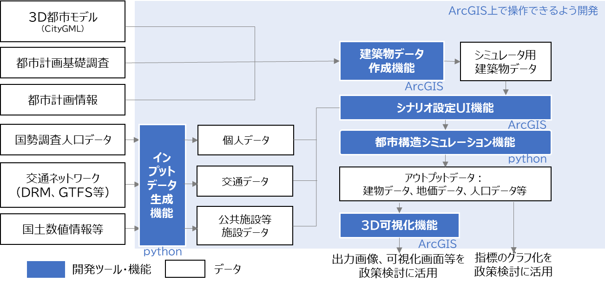
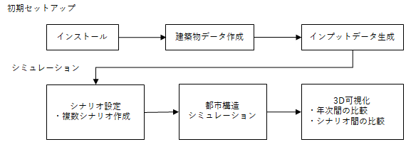

# 3. 本システムの概要

## 3.1. 都市構造シミュレーションの概要

人々の活動がますます多様化する昨今、人々のウェルビーイング向上と持続可能な都市経営を実現するため、市民をはじめとする多様なステークホルダーがまちづくりの将来ビジョンを共有し、共感を得ながらビジョンを実現していくプランニングプロセスの必要性が高まっている。

都市構造シミュレーションは、3D都市モデルを活用し、立地適正化計画等のまちづくり施策が都市構造に与える影響をわかりやすく可視化するシミュレータである。また、ビジョンを広く共有するためのツールとして地方公共団体やコンサルタント等が活用しやすいよう、データ整備からシナリオ設定、シミュレーション、可視化までを簡便に実施することができるユーザーインターフェースを実装している。

本システムは、ArcGISのツールボックスであり、OSSとして開発をしているため、ファイルをPLATEAUホームページよりダウンロードすることで、ArcGIS Proを利用可能なPCであれば無料で利用することが可能である。 
 
**都市構造シミュレーションシステムの概要**

## 3.2. システムの利用フロー

ユーザーは初めにソフトウェアのインストールを行い、各機能を利用可能な状態にする。ソフトウェアをインストールした後に、建築物データ作成機能及びインプットデータ生成機能を実行し、初期データのセットアップを行う。初期セットアップ完了後、シミュレーションのためのシナリオ設定を行う。シナリオ設定は初期セットアップ時に設定したゾーンごとに行う。

シナリオ設定後、作成したシナリオデータを都市構造シミュレーションに渡し、実行する。都市構造シミュレーションは作成したシナリオごとに実行する。

3D可視化機能によりシミュレーション結果を3D地図上に可視化する。同一シナリオの年次ごとの比較やシナリオ間の比較を行い、適切な施策の検討に用いる。 
 
**システムの利用フロー**

## 3.3. 各システムの機能概要

実証システムの機能概要は以下のとおりである。

<table>
<colgroup>
<col style="width: 14%" />
<col style="width: 21%" />
<col style="width: 63%" />
</colgroup>
<thead>
<tr class="header">
<th><strong>分類</strong></th>
<th><strong>機能名</strong></th>
<th><strong>機能説明</strong></th>
</tr>
</thead>
<tbody>
<tr class="odd">
<td rowspan="3">建築物データ作成機能</td>
<td>FootPrint作成</td>
<td><ul>
<li>
建築物データの立地していない空地に対して、今後建築物が建設され得る領域としてFootPrintを追加作成
</li>
<li>
商業地域において敷地が統合されるFootPrintを作成
</li>
</ul></td>
</tr>
<tr class="even">
<td>欠損値補完</td>
<td><ul>
<li>
建築物データの用途、地上階数、延べ床面積、築年数の欠損を補完
</li>
</ul></td>
</tr>
<tr class="odd">
<td>ゾーンコード等付与</td>
<td><ul>
<li>
建築物データの各FootPrintのポリゴン重心が位置するゾーンのゾーンコードを建築物データに付与、また建築物データの各FootPrintのポリゴン重心と最寄り鉄道駅との直線距離と駅名及び前面道路幅員を付与
</li>
</ul></td>
</tr>
<tr class="even">
<td rowspan="4">インプットデータ作成機能</td>
<td>呼出し</td>
<td><ul>
<li>
ユーザーからのファイルパス入力を受け付けた上で、各データ作成機能を呼び出し、ファイルパスを受け渡す
</li>
</ul></td>
</tr>
<tr class="odd">
<td>ゾーンデータ作成機能</td>
<td><ul>
<li>
ゾーンデータに、そのゾーン内に立地する公共施設の数を集計して付与
</li>
<li>
また、ゾーンデータに、そのゾーン内の最も多くを占める用途地域を付与、そのゾーンのポリゴン重心と最寄り鉄道駅との直線距離と駅名を付与
</li>
</ul></td>
</tr>
<tr class="even">
<td>交通データ作成機能</td>
<td><ul>
<li>
全てのゾーンペアに対して、ポリゴン重心間の移動時間を鉄道、バス、自動車それぞれ作成して出力
</li>
</ul></td>
</tr>
<tr class="odd">
<td>個人データ生成</td>
<td><ul>
<li>
国勢調査人口データとゾーンデータから、個人の性年齢・世帯類型等の属性と居住地のデータを出力
</li>
</ul></td>
</tr>
<tr class="even">
<td rowspan="2">シナリオ設定UI機能</td>
<td>ゾーン情報設定</td>
<td><ul>
<li>
<u>都市計画情報設定</u> 
シナリオ設定UIおけるゾーンの選択、選択したゾーンの用途地域及び容積率の変更、変更後の建築物データ・ゾーンデータ出力
</li>
<li>
<u>施設数設定</u> 
シナリオ設定UIおけるゾーンの選択、選択したゾーンの公共施設数の変更、変更後のゾーンデータの出力
</li>
<li>
<u>都市機能誘導・居住誘導施策設定</u> 
シナリオ設定UIおけるゾーンの選択、選択したゾーンの都市機能誘導施策（商業地価の増減割合）の設定、居住誘導施策（住宅地価の増減割合）の設定、変更後のゾーンデータの出力
</li>
</ul></td>
</tr>
<tr class="odd">
<td>当該ゾーン間所要時間設定</td>
<td><ul>
<li>
シナリオ設定UIおけるゾーンの選択、選択したゾーンを交通施策の対象とするかどうかのフラグ付与、鉄道乗車時間・待ち時間、バス乗車時間・待ち時間等の増減割合の設定、変更後の手段別ゾーン間所要時間データの出力
</li>
</ul></td>
</tr>
<tr class="even">
<td>都市構造シミュレーション機能</td>
<td>都市構造シミュレーション機能</td>
<td><ul>
<li>
<u>地価モデル</u> 
周辺の人口や建築物の立地状況、他ゾーンまでの所要時間等から、ゾーンごとの住宅地価及び商業地価を出力
</li>
<li>
<u>転居発生・転入転出・居住地選択モデル</u> 
個人の性年齢・世帯類型等から、個人ごとに翌年の年齢・世帯類型、転居有無、市外への転出・市内への転入の有無、転居後の居住地を出力
</li>
<li>
<u>敷地統合分割モデル</u> 
ゾーンの地価や用途地域、容積率、他ゾーンまでの所要時間等から、個々の建築物が隣接する建築物と敷地を統合して一体的な敷地となるかどうか、個々の建築物が複数の敷地に分割され別々の敷地となるかどうかを出力
</li>
<li>
<u>除却・建設・用途選択モデル</u> 
ゾーンの地価や用途地域、容積率、他ゾーンまでの所要時間等から、個々の建築物が除却有無、空地への新規建設有無、建設される場合の用途・階数・高さ・延べ床面積を出力
</li>
</ul></td>
</tr>
<tr class="odd">
<td>3D可視化機能</td>
<td>可視化</td>
<td><ul>
<li>
シミュレーションの結果をArcGIS Proの画面上に3次元で可視化する
</li>
</ul></td>
</tr>
</tbody>
</table>

## 3.4. 必要な入力データの種類

シミュレーションを実施するために準備する必要があるデータは以下のとおりである。

（具体的な整備方法は、[データの準備](02data_preparation.md)を参照）

### 3.4.1. 建築物データ作成機能
- 建築物データ [GeoDataBase形式]
- 土地利用現況データ[GeoDataBase形式]
- 都市計画決定情報データ[GeoDataBase形式]
- ゾーンポリゴンデータ[shp形式]
- 道路NWデータ[shp形式]
- 鉄道駅位置データ[csv形式]

### 3.4.2. インプットデータ生成機能
- ゾーンポリゴンデータ[shp形式]
- 施設ポイントデータ[csv形式]
- 道路NWデータ[shp形式]
- 鉄道駅位置データ[csv形式]
- 鉄道ＮＷデータ[shp形式]
- バス停位置データ[csv形式]
- バスＮＷデータ[csv形式]
- 国勢調査メッシュ別人口データ[txt形式]
- 250mメッシュポリゴンデータ[shp形式]
- 国勢調査世帯別人口データ[csv形式]

### 3.4.3. 都市構造シミュレーション機能
- 地価データ[shp形式]
