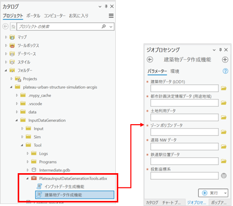
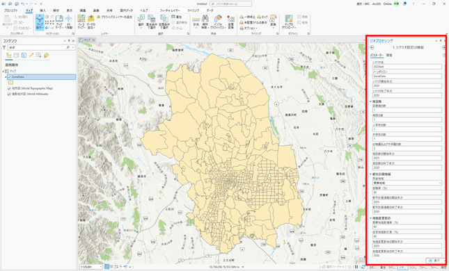
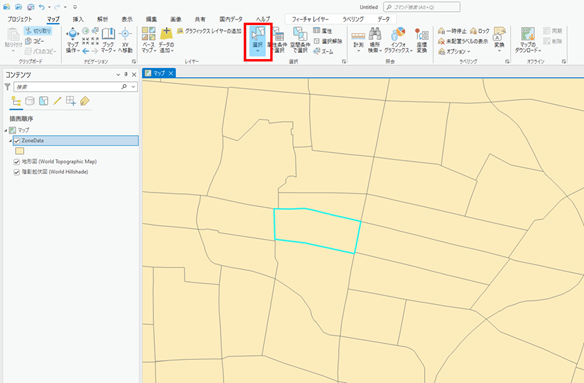
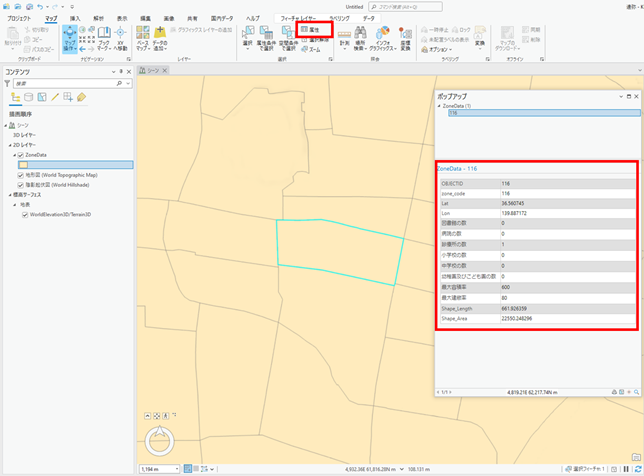
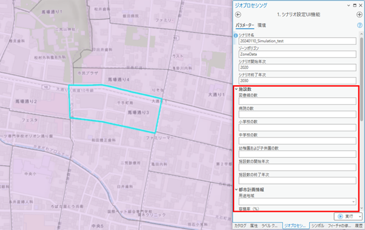
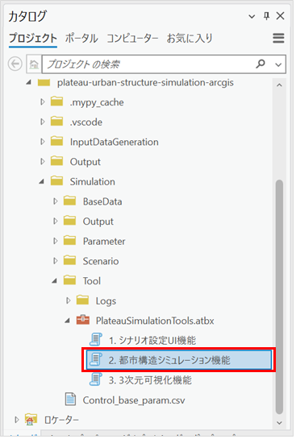
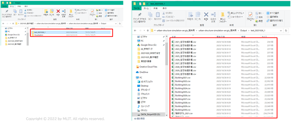
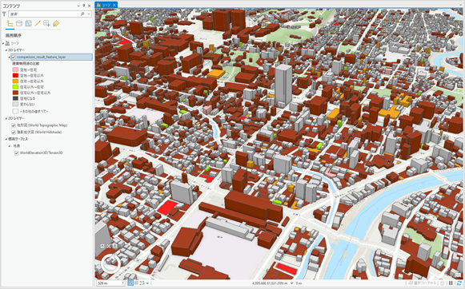
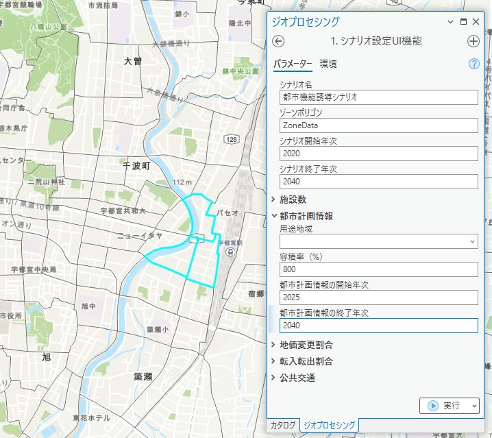

# 1. 本システムの概要

## 1.1. 都市構造シミュレーションの概要

人々の活動がますます多様化する昨今、人々のウェルビーイング向上と持続可能な都市経営を実現するため、市民をはじめとする多様なステークホルダーがまちづくりの将来ビジョンを共有し、共感を得ながらビジョンを実現していくプランニングプロセスの必要性が高まっている。

都市構造シミュレーションは、3D都市モデルを活用し、立地適正化計画等のまちづくり施策が都市構造に与える影響をわかりやすく可視化するシミュレータである。また、ビジョンを広く共有するためのツールとして地方公共団体やコンサルタント等が活用しやすいよう、データ整備～シナリオ設定～シミュレーション～可視化までを簡便に実施することができるユーザーインターフェースを実装している。

本都市構造シミュレーションシステムは、ArcGISのツールボックスとしてOSSとして開発をしており、ファイルをPLATEAUホームページよりダウンロードすることで、ArcGIS Proを利用可能なPCであれば、無料で利用することが可能である。<br>


**都市構造シミュレーションシステムの概要**

## 1.2. システムの利用フロー

ユーザーは初めにソフトウェアのインストールを行い、各機能を利用可能な状態にする。ユーザーはソフトウェアインストール後に建築物データ作成機能及びインプットデータ生成機能を実行し、初期データのセットアップを行う。ユーザーは初期セットアップ完了後、シミュレーションのためのシナリオ設定を行う。シナリオ設定は初期セットアップ時に設定したゾーン毎に行う。

シナリオ設定後、作成したシナリオデータを都市構造シミュレーションに渡し実行する。都市構造シミュレーションは作成したシナリオ毎に実行する。

ユーザーは3D可視化機能によりシミュレーション結果を3D地図上に可視化する。ユーザーは同一シナリオの年次毎の比較やシナリオ間の比較を行い、適切な施策の検討に用いる。

**システムの利用フロー**

## 1.3. 各システムの機能概要

実証システムの機能概要は以下の通りである。

<table>
<colgroup>
<col style="width: 14%" />
<col style="width: 21%" />
<col style="width: 63%" />
</colgroup>
<thead>
<tr class="header">
<th><strong>分類</strong></th>
<th><strong>機能名</strong></th>
<th><strong>機能説明</strong></th>
</tr>
</thead>
<tbody>
<tr class="odd">
<td rowspan="3">建築物データ作成機能</td>
<td>FootPrint作成</td>
<td><ul>
<li><p>建築物データの立地していない空地に対して、今後建築物が建設され得る領域としてFootPrintを追加作成</p></li>
<li><p>商業地域において敷地が統合されるFootPrintを作成</p></li>
</ul></td>
</tr>
<tr class="even">
<td>欠損値補完</td>
<td><ul>
<li><p>建築物データの用途、地上階数、延べ床面積、築年数の欠損を補完</p></li>
</ul></td>
</tr>
<tr class="odd">
<td>ゾーンコード等付与</td>
<td><ul>
<li><p>建築物データの各FootPrintのポリゴン重心が位置するゾーンのゾーンコードを建築物データに付与、また建築物データの各FootPrintのポリゴン重心と最寄り鉄道駅との直線距離と駅名及び前面道路幅員を付与</p></li>
</ul></td>
</tr>
<tr class="even">
<td rowspan="4">インプットデータ作成機能</td>
<td>呼出し</td>
<td><ul>
<li><p>ユーザーからのファイルパス入力を受け付けた上で、各データ作成機能を呼出し、ファイルパスを受け渡す</p></li>
</ul></td>
</tr>
<tr class="odd">
<td>ゾーンデータ作成機能</td>
<td><ul>
<li><p>ゾーンデータに、そのゾーン内に立地する公共施設の数を集計して付与</p></li>
<li><p>また、ゾーンデータに、そのゾーン内の最も多くを占める用途地域を付与、そのゾーンのポリゴン重心と最寄り鉄道駅との直線距離と駅名を付与</p></li>
</ul></td>
</tr>
<tr class="even">
<td>交通データ作成機能</td>
<td><ul>
<li><p>全てのゾーンペアに対して、ポリゴン重心間の移動時間を鉄道、バス、自動車それぞれ作成して出力</p></li>
</ul></td>
</tr>
<tr class="odd">
<td>個人データ生成</td>
<td><ul>
<li><p>国勢調査人口データとゾーンデータから、個人の性年齢・世帯類型等の属性と居住地のデータを出力</p></li>
</ul></td>
</tr>
<tr class="even">
<td rowspan="2">シナリオ設定UI機能</td>
<td>ゾーン情報設定</td>
<td><ul>
<li><p><u>都市計画情報設定</u><br />
シナリオ設定UIおけるゾーンの選択、選択したゾーンの用途地域及び容積率の変更、変更後の建築物データ・ゾーンデータ出力</p></li>
<li><p><u>施設数設定</u><br />
シナリオ設定UIおけるゾーンの選択、選択したゾーンの公共施設数の変更、変更後のゾーンデータの出力</p></li>
<li><p><u>都市機能誘導・居住誘導施策設定</u><br />
シナリオ設定UIおけるゾーンの選択、選択したゾーンの都市機能誘導施策（商業地価の増減割合）の設定、居住誘導施策（住宅地価の増減割合）の設定、変更後のゾーンデータの出力</p></li>
</ul></td>
</tr>
<tr class="odd">
<td>当該ゾーン間所要時間設定</td>
<td><ul>
<li><p>シナリオ設定UIおけるゾーンの選択、選択したゾーンを交通施策の対象とするかどうかのフラグ付与、鉄道乗車時間・待ち時間、バス乗車時間・待ち時間等の増減割合の設定、変更後の手段別ゾーン間所要時間データの出力</p></li>
</ul></td>
</tr>
<tr class="even">
<td>都市構造シミュレーション機能</td>
<td>都市構造シミュレーション機能</td>
<td><ul>
<li><p><u>地価モデル</u><br />
周辺の人口や建築物の立地状況、他ゾーンまでの所要時間等から、ゾーン毎の住宅地価及び商業地価を出力</p></li>
<li><p><u>転居発生・転入転出・居住地選択モデル</u><br />
個人の性年齢・世帯類型等から、個人毎に翌年の年齢・世帯類型、転居有無、市外への転出・市内への転入の有無、転居後の居住地を出力</p></li>
<li><p><u>敷地統合分割モデル</u><br />
ゾーンの地価や用途地域、容積率、他ゾーンまでの所要時間等から、個々の建築物が隣接する建築物と敷地を統合して一体的な敷地となるかどうか、個々の建築物が複数の敷地に分割され別々の敷地となるかどうかを出力</p></li>
<li><p><u>除却・建設・用途選択モデル</u><br />
ゾーンの地価や用途地域、容積率、他ゾーンまでの所要時間等から、個々の建築物が除却有無、空地への新規建設有無、建設される場合の用途・階数・高さ・延べ床面積を出力</p></li>
</ul></td>
</tr>
<tr class="odd">
<td>3D可視化機能</td>
<td>可視化</td>
<td><ul>
<li><p>シミュレーションの結果をArcGIS Proの画面上に3次元で可視化する</p></li>
</ul></td>
</tr>
</tbody>
</table>

## 1.4. 必要な入力データの種類

シミュレーションを実施するために準備する必要があるデータは以下のとおりである。

（具体的な整備方法は、[データの準備](#2103-データ整備方法)を参照）

### 1.4.1. 建築物データ作成機能
- 建築物データ [GeoDataBase形式]
- 土地利用現況データ[GeoDataBase形式]
- 都市計画決定情報データ[GeoDataBase形式]
- ゾーンポリゴンデータ[shp形式]
- 道路NWデータ[shp形式]
- 鉄道駅位置データ[csv形式]

### 1.4.2. インプットデータ生成機能
- ゾーンポリゴンデータ[shp形式]
- 施設ポイントデータ[csv形式]
- 道路NWデータ[shp形式]
- 鉄道駅位置データ[csv形式]
- 鉄道ＮＷデータ[shp形式]
- バス停位置データ[csv形式]
- バスＮＷデータ[csv形式]
- 国勢調査メッシュ別人口データ[txt形式]
- 250mメッシュポリゴンデータ[shp形式]
- 国勢調査世帯別人口データ[csv形式]

### 1.4.3. 都市構造シミュレーション機能
- 地価データ[shp形式]

# 2. シミュレーション方法

## 2.1. 建築物データ作成機能

ArcGIS Proの「カタログ」欄より下記のフォルダーを表示し、「建築物データ作成機能」をダブルクリックして起動する。

```txt
InputDataGeneration\Tool\PlateauInputDataGenerationTools.atbx
```



「建築物データ作成機能」画面の各項目に入力データを指定する。

インプットデータ指定後に「実行」ボタンを押す。

## 2.2. インプットデータ生成機能

### 2.2.1. データの配置

以下のフォルダーにインプットデータ生成機能の入力データを配置する。

```txt
InputDataGeneration\InputDataGeneration\Input
```

### 2.2.2. インプットデータ生成機能の起動

ArcGIS Proの「カタログ」欄より下記のフォルダーを表示し、「インプットデータ生成機能」をダブルクリックして起動する。

```txt
InputDataGeneration\Tool\PlateauInputDataGenerationTools.atbx
```


画面起動後に該当エリアのEPSGコードを入力し、「実行」ボタンを押し処理を実行する。

処理が完了すると、シーンに「ZoneData」が追加される。

## 2.3. シナリオ設定UI機能

### 2.3.1. 通常の操作方法

#### 2.3.1.1. シナリオ設定UI機能の起動

ArcGIS Proの「カタログ」欄より下記のフォルダーを表示し、「シナリオ設定UI」をダブルクリックして起動する。

```txt
Simulation\Tool\PlateauSimulationTools.atbx
```


シナリオ設定UIの選択

#### 2.3.1.2. シナリオ設定UI機能のパラメータ入力

シナリオ設定UI機能で必要なパラメータを入力する。入力可能なパラメータ一覧は表1のとおりである。



シナリオ設定UIのパラメータ入力画面

**シナリオ設定UI入力パラメータ一覧表**

<table>
  <tr><th colsplan="2">入力項目</th><th>入力する内容</th></tr>
  <tr><td rowspan="5">施設数</td><td>図書館の数</td><td>ゾーン内の図書館の数を指定します</td></tr>
  <tr><td>病院の数</td><td>ゾーン内の病院の数を指定します</td></tr>
  <tr><td>中学校の数</td><td>ゾーン内の中学校の数を指定します</td></tr>
  <tr><td>幼稚園および子供園の数</td><td>ゾーン内の幼稚園及び子供園の数を指定します</td></tr>
  <tr><td>施設数の開始年次 ※2</td><td>指定した施設数が適用される期間の開始年次を指定します</td></tr>
  <tr><td rowspan="3">都市計画情報</td><td>用途地域</td><td>ゾーンの用途地域を指定します</td></tr>
  <tr><td>容積率（%）</td><td>ゾーンの容積率を指定します</td></tr>
  <tr><td>都市情報の開始年次 ※2</td><td>指定した都市計画情報が適用される期間の開始年次を指定します</td></tr>
  <tr><td rowspan="3">地価変更割合</td><td>商業地価変更割合（%）</td><td>商業地価の割増率（%）を指定します</td></tr>
  <tr><td>住宅地価変更割合（%）</td><td>住宅地価の割引率（%）を指定します</td></tr>
  <tr><td>地価変更割合の開始年次 ※2</td><td>指定した地価変更割合が適用される期間の開始年次を指定します</td></tr>
  <tr><td rowspan="3">転入転出割合</td><td>転入率（%）</td><td>転入率の変化率（%）を指定します</td></tr>
  <tr><td>転出率（%）</td><td>転出率の変化率（%）を指定します</td></tr>
  <tr><td>転入転出割合の開始年次 ※2</td><td>指定した転入転出割合が適用される期間の開始年次を指定します</td></tr>
  <tr><td rowspan= "9">公共交通</td><td>鉄道乗車時間（%）</td><td>鉄道乗車時間を現況からの割合（%）で指定します</td></tr>
  <tr><td>鉄道待ち時間（%）</td><td>鉄道待ち時間を現況からの割合（%）で指定します</td></tr>
  <tr><td>鉄道アクセス時間（%）</td><td>鉄道アクセス時間を現況からの割合（%）で指定します</td></tr>
  <tr><td>鉄道イグレス時間（%）</td><td>鉄道イグレス時間を現況からの割合（%）で指定します</td></tr>
  <tr><td>鉄道運賃（%）</td><td>鉄道運賃を現況からの割合（%）で指定します</td></tr>
  <tr><td>バス待ち時間（%）</td><td>バス待ち時間を現況からの割合（%）で指定します</td></tr>
  <tr><td>バス運賃（%）</td><td>バス運賃を現況からの割合（%）で指定します</td></tr>
  <tr><td>公共交通情報の開始年次 ※2</td><td>指定した公共交通の設定が適用される期間の開始年次を指定します</td></tr>
  <tr><td>公共交通情報の終了年次</td><td>指定した公共交通の設定が適用される期間の終了年次を指定します</td></tr>
</table>

- ※1 「シナリオ名」、「ゾーンコード」、「シナリオ開始年次」、「シナリオ終了年次」の4項目は入力必須項目。
- ※2 施設数等の各施策の「開始年次」は、「シナリオ開始年次」の翌年以降で設定。

ゾーンポリゴンのパラメータ入力欄はデフォルト（ZoneData）のままとし、シーンの「ZoneData」から施策を実施したい該当エリアのポリゴンを選択した上で実行する。

シーンに「ZoneData」が追加されていない場合は、下記ディレクトリより「ZoneData」をシーンに追加した上で選択する。

```txt
Simulation\BaseData\BaseData.gdb\ZoneData
```

「カタログ」欄でゾーンポリゴンがあるフォルダー（`Simulation\BaseData\BaseData.gdb`）を表示し、「ZoneData」をシーンへドラッグアンドドロップする。<br>


「マップ」タブの選択ツールを使用し、該当エリアのポリゴンをクリックすることで選択できる。<br>


「マップ」タブの「属性」をクリックした上でゾーンコードを調べたい箇所のポリゴンを選択すると、ポップアップウィンドウの中に選択したゾーンの `zone_code` や各種施設の数が表示される。<br>


#### 2.3.1.3. シナリオ設定UI機能の実行

各種パラメータを入力およびゾーンを選択した状態で、シナリオ設定UI機能の実行ボタンをクリックして処理を実行する。<br>


### 2.3.2. 複数施策を1つのシナリオで設定したい場合

#### 2.3.2.1. シナリオの新規作成

立地適正化計画が実現した場合をシナリオとしてシミュレーションしたい場合、「都市機能誘導区域における容積率の緩和」、「居住誘導区域における家賃補助」といったように、異なる区域での複数種類の施策を1つのシナリオとして実施する必要がある。

その場合には、シナリオ名を指定する際に、既存のシナリオを指定した上で、異なるゾーンを選択しなおして再度実行することで、1つのシナリオで複数施策を設定することが可能である。

1回目のシミュレーションは前項に示した通り任意のシナリオ名を設定して実行する。
<br>


#### 2.3.2.2. 施策の追加設定

2回目以降のシミュレーションでは、既存のシナリオ名を指定した上で、異なるゾーンを選択して実行する。
<br>


### 2.3.3. 施策を設定せずにシミュレーションを実施する場合（趨勢シナリオの実施）

施策を何も行わない場合の将来（いわゆる趨勢シナリオ）をシミュレーションしたい場合には、施策を何も設定せずにシナリオ設定UIを実行する必要がある。

具体的には、シナリオ設定UIにてシナリオ名、ゾーン選択、シナリオ開始年次、シナリオ終了年次のみを設定し、その他の項目は空欄のまま実行する。
<br>


## 2.4. 都市構造シミュレーション機能

### 2.4.1. 都市構造シミュレーション機能の起動

ArcGIS Proの「カタログ」欄より下記のフォルダーを表示し、「都市構造シミュレーション機能」をダブルクリックして起動する。

```txt
Simulation\Tool\PlateauSimulationTools.atbx
```
<br>


### 2.4.2. シナリオ格納ディレクトリの設定

「シナリオ格納ディレクトリ」欄にシミュレーションを実施したいシナリオが格納されているフォルダーを設定する。

```txt
Simulation\Scenario\{シナリオ名}
```


### 2.4.3. 都市構造シミュレーション機能の実行

都市構造シミュレーション機能の実行ボタンをクリックして処理を実行する。

都市構造シミュレーション機能の処理が完了すると、`Output` フォルダーに設定したシナリオ名のフォルダーが作成され、シミュレーション結果ファイルが保存されていることが確認できる。



## 2.5. 3次元可視化機能

### 2.5.1. 3次元可視化機能の起動

ArcGIS Proの「カタログ」欄より下記のフォルダーを表示し、「3次元可視化機能」をダブルクリックして起動する。

```txt
Simulation\Tool\PlateauSimulationTools.atbx
```


### 2.5.2. 比較されるシナリオの設定

「比較されるシナリオ」欄で比較される側のシナリオとして、都市構造シミュレーション機能によって作成されたCSVファイルの中から、3次元可視化対象とする年次のものを選択する。CSVファイルは以下の命名規則で生成されている。（Building以外のデータを選択するとエラーが出るため注意）

```txt
Output\{シナリオ名}\Building{年次}.csv
```


「比較するシナリオ」は着目したいシナリオ、「比較されるシナリオ」は基準となるシナリオである。例えば、「都市機能誘導シナリオ」と「趨勢シナリオ」の建築物用途の比較をしたい場合、「比較するシナリオ」として「都市機能誘導シナリオ」を、「比較されるシナリオ」として「趨勢シナリオ」を入力する。

### 2.5.3. 比較するシナリオの設定

「比較するシナリオ」欄で比較する側のシナリオとして、都市構造シミュレーション機能によって作成されたCSVファイルの中から、3次元可視化の対象とする別の年次又は別のシナリオのファイルを選択する。

```txt
Output\{シナリオ名}\building{年次}.csv
```


### 2.5.4. 比較項目の設定

「比較項目」欄で比較する項目を下記の項目から選択する。

- 建築物用途の比較
  - 建築物用途を住宅、住宅以外、空地に分類して比較する。
- 建築物用途の比較_詳細
  - 建築物用途の値で比較する。
- 建築物存在有無の比較
  - 建築物ができるか、空地になるかで分類する。
- 建築物高さの差分
  - 建築物高さの増減で比較する。


### 2.5.5. 3次元可視化機能の実行

3次元可視化機能の実行ボタンをクリックして処理を実行する。

処理が完了すると、ArcGIS Proのローカルシーンにシナリオ比較によって着色された3D都市モデルが表示される。



## 2.6. シナリオの設定例

### 2.6.1. 設定可能な施策

シナリオ設定UI機能を用いることで、以下の施設整備、都市機能誘導、居住誘導、公共交通等の施策を設定することが可能

<table>
  <thead>
    <tr>
      <th colspan="3">対象施策</th>
      <th>シナリオ設定UI機能</th>
      <th>対応施策名</th>
      <th>インブットデータ 手作業変更による対応</th>
    </tr>
    <tr></tr>
  </thead>
  <tbody>
    <tr>
      <td>施設整備</td>
      <td colspan="2">公共施設等の整備</td>
      <td>- ソーンの施設数の変更</td>
      <td>- 施設数</td><td></td>
    </tr>
    <tr>
      <td rowspan="3">都市機能誘導</td>
      <td colspan="2">商業施設の誘導(税制優遇等)</td>
      <td>- ソーンの商業地価割増率の変更</td>
      <td>- 商業地価変更割合</td><td></td>
    </tr>
    <tr>
      <td colspan="2">容積率の緩和</td>
      <td>- ソーンの容積率の変更</td>
      <td>- 都市計画情報</td><td></td>
    </tr>
    <tr>
      <td colspan="2">用途地域の変更</td>
      <td>- ソーンの用途地域の変更(用途制限緩和)</td>
      <td>- 都市計画情報</td><td></td>
    </tr>
    <tr>
      <td>居住誘導</td>
      <td colspan="2">税制優遇や補助等による居住誘導</td>
      <td>- ソーンの住宅地価の割引率の変更(世帯類型別に設定)</td>
      <td>- 住宅地価変更割合</td><td></td>
    </tr>
    <tr>
      <td rowspan="6">公共交通</td>
      <td rowspan="2">鉄道バスの新規開業・路線変更</td>
      <td>簡易設定</td>
      <td>- ソーンの最寄り駅距離の変更<br>- ソーン間所要時間の割合を一律変更</td>
      <td>- 鉄道変更<br>- バス変更</td><td></td>
    </tr>
    <tr>
      <td>詳細設定</td>
      <td></td><td></td>
      <td>- 鉄道NWデータ(ライン)の差し替え<br>- 鉄道駅データ(ポイント)の差し替え<br>- バスNWデータの差し替え</td>
    </tr>
    <tr>
      <td rowspan="2">鉄道バスの運行頻度向上</td>
      <td>簡易設定</td>
      <td>- ソーン間所要時間の割合を一律変更</td>
      <td colspan="2">- 鉄道変更<br>- バス変更</td>
    </tr>
    <tr>
      <td>詳細設定</td>
      <td></td><td></td>
      <td>- 鉄道NWデータ(ライン)の差し替え<br>- バスNWデータの差し替え</td>
    </tr>
    <tr>
      <td rowspan="2">鉄道バスの料金割引</td>
      <td>簡易設定</td>
      <td>- ソーン間所要時間の割合を一律変更(割引料金を時間換算して所要時間から引く)</td>
      <td colspan="2">- 鉄道変更<br>- バス変更</td>
    </tr>
    <tr>
      <td>詳細設定</td>
      <td></td><td></td>
      <td>- 鉄道NWデータ(ライン)の差し替え<br>・バスNWデータの差し替え</td>
    </tr>
    <tr>
      <td>そのほか</td>
      <td colspan="2">転入転出割合の変化</td>
      <td>- 転入率、転出率の変更割合の変更</td>
      <td >- 転入転出割合</td><td></td>
    </tr>
  </tbody>
</table>

### 2.6.2. シナリオ設定例

#### 2.6.2.1. シナリオ①：都市機能誘導シナリオ

都市機能誘導シナリオとして、2020年をシミュレーション開始年次とし、20年後の2040年までをシミュレーションする。

具体の施策としては「都心中心部における容積率の緩和」、「都市機能誘導区域における建替促進助成」の2つを設定することとする。

| 施策                                 | 設定内容                                                                              |
| ------------------------------------ | ------------------------------------------------------------------------------------- |
| 都心中心部における容積率の緩和       | 駅前の3ゾーンの容積率を800%に設定する。施策の開始年次は2025年とする。                 |
| 都市機能誘導区域における建替促進助成 | 都市機能誘導区域内の商業地価割増率を「20%」に設定する。施策の開始年次は2025年とする。 |

##### 2.6.2.1.1. 都心中心部における容積率の緩和の設定

下図のとおりにシナリオ名（シナリオ名は任意）、シナリオ開始年次、シナリオ終了年次を入力する。また、都市計画情報の容積率、開始年次、終了年次を入力する。

また、対象となる駅前のゾーンを複数選択する（今回は3つのゾーン）。
※「マップ」タブの選択ツールで、Shiftを押しながらクリックすることで複数選択可能。



##### 2.6.2.1.2. 都市機能誘導区域における建替促進助成①

都市機能誘導区域のポリゴンデータを用意し、レイヤーに追加する。
※下図のように対象となるポリゴンデータ（shp形式等）をマップ上にドラッグアンドドロップする。


##### 2.6.2.1.3. 都市機能誘導区域における建替促進助成②

都市機能誘導区域のポリゴンに重なるゾーンを選択する。

※「マップ」タブの「空間条件で選択」ボタンをクリックすることで下図のような画面が表示される。入力フィーチャーにZoneData、選択フィーチャに対象となるポリゴンデータを設定し「適用」または「OK」をクリックすることで、条件と合うゾーンが選択される。


##### 2.6.2.1.4. 都市機能誘導区域における建替促進助成③

ゾーンを選択した状態のままで、下図のとおりにシナリオ名（シナリオ名は[都心中心部における容積率の緩和の設定](#26211-都心中心部における容積率の緩和の設定)の際に入力したものと同じもの）、シナリオ開始年次、シナリオ終了年次を入力する。また、地価変更割合の商業地価割増率、開始年次、終了年次を入力する。


#### 2.6.2.2. シナリオ②：交通改善シナリオ

交通改善シナリオとして、2020年をシミュレーション開始年次とし、20年後の2040年までをシミュレーションする。

具体の施策としては「東西幹線のバス運行頻度改善」を設定することとする。

| 施策                       | 設定内容                                                                                         |
| -------------------------- | ------------------------------------------------------------------------------------------------ |
| 東西幹線のバス運行頻度改善 | 東西幹線エリア内を移動する場合の、バスの待ち時間を半分に設定する。施策の開始年次は2030年とする。 |

対象となるエリアのポリゴンを用意し、条件に合うゾーンを選択する。（ポリゴンを活用したゾーンの選択方法は「シナリオ①：都市機能誘導シナリオ」を参照）

下図のとおりにシナリオ名（シナリオ名は任意）、シナリオ開始年次、シナリオ終了年次を入力する。また、公共交通のバス待ち時間、開始年次、終了年次を入力する。

※選択したゾーン間のバス待ち時間のみを半分にする（選択したゾーンとそれ以外の地域のバス待ち時間は変更なし）


